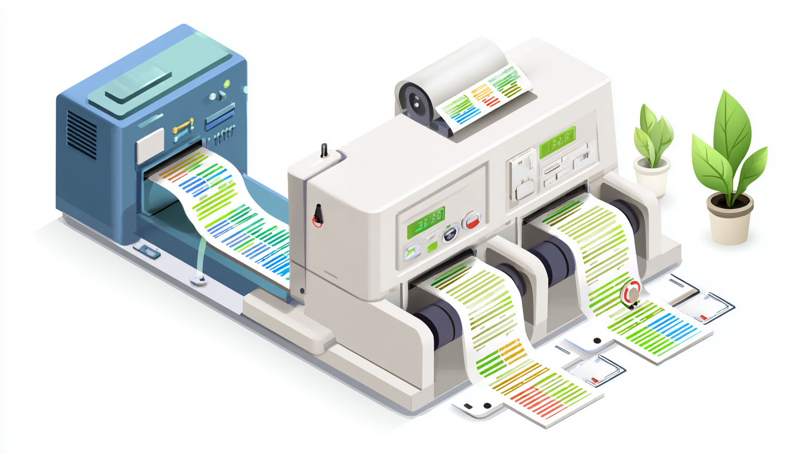

# Stripe Reconciler



A SvelteKit SaaS application that processes Stripe CSV files and generates FreeAgent-compatible reconciliation data.

## Features

- Upload Stripe balance and payouts CSV files
- Process and transform data according to FreeAgent requirements
- Generate a downloadable CSV file with three columns: date, amount, and description
- Modern, responsive UI built with Tailwind CSS

## Data Processing Rules

### Stripe Balance File Processing
- **Sales**: Creates a positive line for each sale gross amount
- **Fees**: Creates a negative line for each fee amount
- **Refunds**: Creates a negative line for refund amounts
- **Description Format**: `{category} | {trace_id} | {balance_transaction_id} | {product_name}`

### Stripe Payouts File Processing
- **Positive Payouts**: Converts to negative "transfer to bank account" amounts
- **Negative Payouts**: Converts to positive "stripe direct debit" amounts
- **Description Format**: `{category} | {trace_id} | {payout_id}`

### Output Format
The generated CSV file contains exactly three columns:
1. **Date**: DD/MM/YYYY format
2. **Amount**: Positive for additions, negative for deductions
3. **Description**: Complete transaction description

## Balance Calculation Tables

The application generates four summary tables that provide detailed reconciliation information:

### Table 1: Activity Summary
1. **Number of Sales**: Mathematical sum of all transactions in the "Amount" column
2. **Number of Fees**: Mathematical sum of all fees in the "fee" column  
3. **Net Balance Change from Activity**: Sum of total sales + total fees

### Table 2: Payout Summary
1. **Number of Transfer Payouts**: Sum of all transfer payouts (negative amounts)
2. **Number of Stripe Direct Debits**: Sum of stripe charges to bank account (positive amounts)
3. **Total Payouts**: Sum of payouts + debits

### Table 3: Balance Change
1. **Count of Transactions**: Total number of sales transactions
2. **Charges Gross Amount**: Sum of all sales before fees or refunds
3. **Charges Fees**: Total amount of fees (negative)
4. **Refunds Count**: Number of refunds made
5. **Refunds Gross Amount**: Sum of all refunds (negative)
6. **Balance Change from Activity Count**: Sum of transaction count + refund count
7. **Balance Change from Activity**: Sum of Charges Gross + Charges Fees + Refunds Gross

### Table 4: Ending Balance
1. **Starting Balance**: Dynamically set from form input
2. **Net Balance Change from Activity**: From Table 1, row 3
3. **Total Payouts**: From Table 2, row 3
4. **Ending Balance**: Starting Balance + Net Balance Change + Total Payouts

## Installation

1. Clone the repository
2. Install dependencies:
   ```bash
   npm install
   ```

3. Start the development server:
   ```bash
   npm run dev
   ```

4. Open your browser and navigate to `http://localhost:5173`

## Getting Reports from Stripe

Before using this tool, you need to download the required CSV reports from your Stripe dashboard:

1. **Go to Reports > Balance Summary**
2. **Change dates to your financial year** (e.g., 2024-05-01 to 2025-04-30)
3. **Download the full (all columns) "Balance change from Activity" Report**
4. **Download the full (all columns) "Payouts" Report**

## Usage

1. Upload your Stripe balance CSV file (itemised activity)
2. Upload your Stripe payouts CSV file
3. Click "Process Files" to generate the FreeAgent-compatible CSV
4. Download the generated `freeagent.csv` file

## Technical Details

- **Framework**: SvelteKit
- **Styling**: Tailwind CSS
- **Language**: TypeScript
- **File Processing**: Client-side CSV parsing and transformation

## CSV Format Requirements

### Input Files
- **Balance File**: Must contain columns for balance_transaction_id, created, gross, fee, reporting_category, trace_id, and description
- **Payouts File**: Must contain columns for payout_id, effective_at, gross, and trace_id

### Output File
- No header row
- Three columns: date, amount, description
- Chronologically sorted by date
- FreeAgent-compatible format

## Development

To run the development server:
```bash
npm run dev
```

To build for production:
```bash
npm run build
```

To preview the production build:
```bash
npm run preview
```

## Testing

The `samples/` directory contains example CSV files for testing the application functionality. 